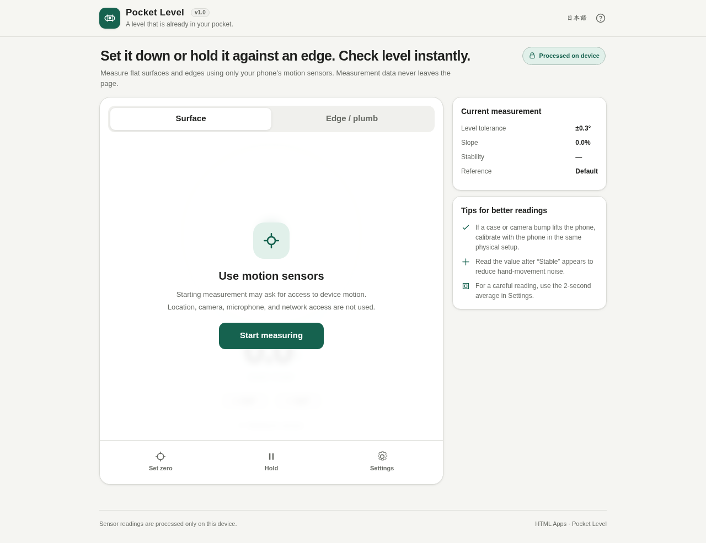
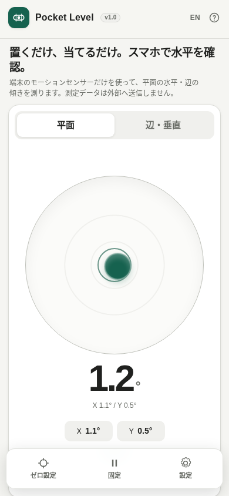

# Pocket Level

[](https://github.com/ttomohisa/htmlapps-pocket-level/actions/workflows/deploy-pages.yml)
[](LICENSE)
[](https://ttomohisa.github.io/htmlapps-pocket-level/)

[日本語版 README](README.ja.md)

An install-free, privacy-focused **spirit level / inclinometer** for smartphones. Pocket Level reads the device orientation sensor directly in the browser and turns your phone into a simple measuring tool without installing a native app.

## 🚀 Live demo

### [Open Pocket Level on GitHub Pages](https://ttomohisa.github.io/htmlapps-pocket-level/)

The page itself is delivered by GitHub Pages, but sensor readings, calibration, averaging, and display updates are processed locally on your device. Pocket Level has no runtime CDN, analytics, telemetry, account, or remote API.

[](https://ttomohisa.github.io/htmlapps-pocket-level/)



## Features

- **Surface mode** with a two-axis bullseye, X/Y angles, and combined tilt
- **Edge / plumb mode** for checking a shelf edge, wall, post, or other one-axis surface
- Degree and **slope %** display
- **Set zero** to use the current angle as a temporary reference
- **Hold / Resume** to freeze a reading while moving the phone
- Configurable level tolerance: ±0.1°, ±0.3°, ±0.5°, ±1.0°
- **Stability indicator** based on recent sensor variance
- Optional sound and vibration when a stable reading enters the level zone
- Screen Wake Lock when supported
- **2-second precision average** with measured spread
- **180° two-point calibration** to estimate device-side X/Y sensor bias from two readings on the same surface
- Sensor availability detection with clear error messages for unsupported, denied, insecure, or no-event states
- Japanese and English UI in the same HTML
- Smartphone-first layout with a bottom action bar for one-handed use
- No third-party runtime library

## Why the two-point calibration?

A normal **Set zero** button assumes the reference surface itself is already level. Pocket Level also offers a two-point calibration that measures the same surface twice with the phone rotated 180°.

Approximately:

```text
m1 = surface + deviceBias
m2 = -surface + deviceBias
```

Therefore:

```text
(m1 + m2) / 2 ≈ deviceBias
```

This helps estimate a constant sensor offset without requiring a perfectly level reference surface.

It cannot compensate for physical contact differences caused by a case, buttons, rounded edges, or a camera bump. Pocket Level is a convenient indicator, not certified construction or surveying equipment.

## Quick start

### Use the web demo

Just [open the demo](https://ttomohisa.github.io/htmlapps-pocket-level/) on a smartphone. No installation or account is required.

1. Tap **Start measuring**.
2. Allow motion / orientation access if the browser asks.
3. Use **Surface** for a flat face or **Edge / plumb** for one-axis measurement.
4. Use **Set zero** when you want to measure relative to the current angle.
5. Use **Hold** to keep a reading on screen while moving the phone.

### Use the downloaded HTML

`dist/index.html` is fully self-contained and the UI can be opened directly as a local file.

However, smartphone browsers may restrict motion sensors for `file://` pages. If Pocket Level reports that sensor values are unavailable, use the HTTPS-hosted GitHub Pages / Browser Kitty version instead.

A local web server or backend API is not required for the app itself; HTTPS static hosting is sufficient for browsers that require a secure context for sensor access.

## Sensor availability and error handling

Pocket Level does not show `0.0°` as if it were a live measurement before a real sensor sample has arrived.

The start screen detects and reports common sensor problems, including:

- Device Orientation API unavailable
- insecure context where the browser requires HTTPS
- motion / orientation permission denied
- local `file://` pages that receive no sensor events
- a browser or device that exposes the API but does not deliver usable orientation samples

When a fatal availability error is detected, **Start measuring** is disabled instead of leaving a non-working control active.

## Precision tools

### 2-second average

Pocket Level can collect sensor readings for two seconds, average them, and report the spread. This is useful when small hand movements make a single instantaneous reading hard to judge.

### 180° two-point calibration

1. Put the phone on the surface and record the first calibration point.
2. Keep the same phone face against the same surface.
3. Rotate the phone 180° in the plane.
4. Record the second point.
5. Pocket Level estimates the constant X/Y sensor bias and stores the correction locally.

Calibration can be reset from the settings panel.

## Publish with GitHub Pages

The repository includes a workflow that builds the standalone HTML, verifies the repository, and deploys `dist/` to GitHub Pages.

1. Push the repository to GitHub as `htmlapps-pocket-level`.
2. Open **Settings → Pages → Build and deployment → Source** and select **GitHub Actions**.
3. Push to `main`, or manually run **Deploy GitHub Pages** from the Actions tab.
4. After a successful deployment, the demo is available at `https://ttomohisa.github.io/htmlapps-pocket-level/`.

Each deployment rebuilds and verifies the generated files before publishing them.

## Development and build layout

```text
.
├─ src/index.template.html       # Application source
├─ app.config.json               # App metadata and version
├─ dependencies.json             # Embedded dependency manifest (currently none)
├─ build-standalone.bat          # Windows build entry point
├─ build-standalone.ps1          # Standalone HTML builder
├─ scripts/check-repository.ps1  # Build + repository verification
├─ dist/index.html               # Generated readable single-file app
├─ dist/index.self-extract.html  # Generated gzip self-extracting variant
└─ .github/workflows/
   ├─ build-standalone.yml       # Build validation
   └─ deploy-pages.yml           # Automatic GitHub Pages deployment
```

### Build on Windows

```bat
build-standalone.bat
```

Or run the repository check directly:

```powershell
powershell.exe -NoLogo -NoProfile -ExecutionPolicy Bypass -File .\scripts\check-repository.ps1
```

Generated files include:

- `dist/index.html`
- `dist/index.self-extract.html`
- `dist/build-manifest.json`
- `dist/dependency-manifest.json`

Edit `src/index.template.html`, not the generated files in `dist/`.

## Privacy and runtime network protection

Pocket Level is designed as a local-first utility.

- Sensor readings stay in browser memory
- Calibration and preferences are stored only in `localStorage` when available
- No camera, microphone, GPS, account, or cloud storage is used
- No analytics or telemetry is included
- No third-party runtime library is required
- The generated HTML uses a Content Security Policy containing `connect-src 'none'`

The GitHub Pages version requires the initial HTML request, but the measurement data itself is not transmitted by the app.

## Limitations

- Sensor accuracy varies by phone model, browser, calibration state, case, and physical contact geometry.
- A camera bump, rounded case, buttons, or uneven phone edge can introduce mechanical error even if the sensor itself is accurate.
- Some browsers restrict Device Orientation / Motion on local `file://` pages; use HTTPS when sensor events are unavailable.
- iOS and some other browsers require an explicit user gesture before motion / orientation permission can be requested.
- Wake Lock, vibration, and audio feedback depend on browser support and user settings.
- The app is not certified measuring equipment and should not be used where calibrated professional measurement is required.

## Dependencies

Pocket Level currently uses **no third-party runtime library**. Sensor processing, calibration, drawing, UI, persistence, and averaging are implemented with browser-native APIs and application code.

See [THIRD_PARTY_NOTICES.md](THIRD_PARTY_NOTICES.md) for dependency information.

## Contributing

Bug reports and feature proposals are welcome through GitHub Issues. See [CONTRIBUTING.md](CONTRIBUTING.md) for development guidance.

## License

Copyright © 2026 ttomohisa

Licensed under the [MIT License](LICENSE).
